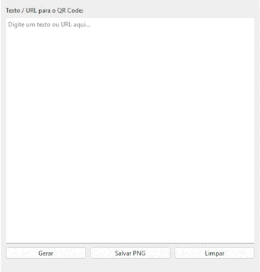

# Gerador de QR Code em PyQt6

Este projeto é um **gerador de QR Code** desenvolvido com **PyQt6** para a interface gráfica e **Python QR Code** para a geração do código. O aplicativo permite que o usuário insira um texto ou URL, gere um QR Code e salve a imagem gerada em formato **PNG**.

## Funcionalidades

- **Geração de QR Code**: Insira qualquer texto ou URL e gere um QR Code.
- **Visualização da prévia**: O QR Code gerado será exibido como uma imagem na interface.
- **Salvar em PNG**: O QR Code gerado pode ser salvo como uma imagem em formato PNG.
- **Limpeza**: Limpeza dos campos de entrada e da imagem gerada.

## Demonstração

## Pré-requisitos

Para executar, basta clicar no arquivo **Generator.exe** dentro da pasta .exe.

